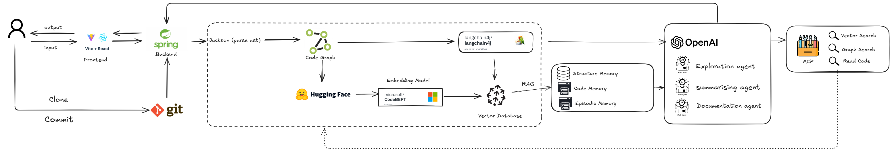

<div align="center">
  

<h2 style="font-size: 1.5rem; margin: 1.5rem 0;">AI-Powered Documentation Platform for Developers</h2>

[](LICENSE)
[](https://openjdk.java.net/)
[](https://spring.io/projects/spring-boot)
[](https://reactjs.org/)
[](https://www.typescriptlang.org/)

</div>

## 🏆 Competition Track

**Track 3: Fix the Docs** - *Smarter, Faster, Maintainable Documentation for the Real World by iFAST*

### Problem Statement

In real-world tech environments, documentation is a critical but broken part of the software development lifecycle:

* **Writing it is slow, repetitive, and often skipped**
* **Reading it is painful and time-consuming**, especially for new joiners
* **Maintaining it is impractical** in fast-changing systems — documentation quickly becomes outdated, misleading, or irrelevant

This leads to **onboarding delays, wasted engineering time, and avoidable bugs** — all due to poor or outdated docs.

### Our Solution Focus

AutoDocX addresses **three key dimensions** of the documentation problem:

#### 1. Simplify Writing

* **Auto-generate starter docs** from code, git commits, or comments
* **Templates and AI suggestions** to make writing faster
* **Real-time writing assistants** and markdown validators
* **AI-powered documentation generation** from GitHub repositories

#### 2. Speed Up Reading

* **Summarization tools** (TL;DR for long docs)
* **Q\&A search**: Ask questions, get contextual answers (ChatGPT for docs)
* **Visualizations**: Flow diagrams, API call graphs, changelogs
* **Semantic search** for faster information discovery

#### 3. Make Maintenance Easy

* **Detect stale documentation** (doc drift vs. code)
* **Notify users** when dependent components change
* **Auto-suggest doc updates** from diffs or pull requests
* **Documentation drift detection** and automated sync monitoring

## ⚙️ Technical Approach

### Core Architecture

* **Graph-Driven Understanding**: The codebase is represented as a knowledge graph (nodes = classes/methods/fields, edges = dependencies/relations). Exploration and reasoning always start from graph navigation.

* **Agentic Workflow**: The LLM runs in an iterative loop, exploring the graph, retrieving supporting code, and drafting documentation.

* **Tool-Augmented Reasoning**: The agent grounds all insights via toolbox queries (graph traversal, code access, structure inspection).

* **Memory Organization**:

  * **Episodic** – interaction flow & status
  * **Code** – retrieved code chunks (summarized)
  * **Structure** – graph insights & dependencies

* **RAG + VectorDB**: Memory is complemented by semantic retrieval, enabling natural language search over code and prior context.

* **Prototype Focus**: Automated, grounded README generation with graph-first comprehension enhanced by semantic retrieval.

---

## 🔎 Overview

AutoDocX is a **web-based documentation platform** that revolutionizes how developers create, maintain, and share software documentation. Unlike traditional CLI-driven tools, AutoDocX provides a **100% interface-driven experience** with AI-powered assistance for generating, editing, and maintaining documentation.

### Key Features

* **AI-Powered Documentation Generation** - Automatically generate documentation from GitHub repositories
* **Rich Text Editor** - Obsidian-like editing experience with real-time editing and live preview
* **Intelligent Q\&A System** - Ask natural language questions about your documentation
* **Documentation Drift Detection** - Keep docs in sync with code changes
* **Easy Sharing** - Generate public links with configurable permissions
* **TL;DR Summarization** - Get quick summaries of complex documentation
* **GitHub Integration** - Seamless OAuth authentication and repository access

## 👷🏼 Architecture

### System Overview


### Tech Stack

#### Frontend

* **React 19.1.1** - Modern UI framework with concurrent features
* **TypeScript 5.8.3** - Type-safe development
* **Vite** - Fast build tool and dev server
* **Tailwind CSS** - Utility-first CSS framework
* **React Router** - Client-side routing
* **Framer Motion** - Smooth animations and transitions

#### Backend

* **Spring Boot 3.3.4** - Enterprise Java framework
* **Java 17** - Modern Java with latest features
* **Spring AI 1.0.0-M4** - AI integration framework
* **Spring Security** - Authentication and authorization
* **OAuth2 Client** - GitHub integration
* **JGit 6.10.0** - Git operations
* **JavaParser 3.27.0** - Code analysis and parsing

#### AI & Processing

* **OpenAI Integration** - GPT models for content generation
* **Vector Embeddings** - Semantic search and Q\&A
* **Code Analysis** - AST parsing for documentation generation
* **RAG Pipeline** - Retrieval-Augmented Generation

## 🚀 Quick Start

### Prerequisites

* **Java 17+**
* **Node.js 18+**
* **Maven 3.6+**
* **Git**

### Environment Configuration

Create `src/main/resources/application.yml`:

```yaml
spring:
  security:
    oauth2:
      client:
        registration:
          github:
            clientId: your-github-client-id
            clientSecret: your-github-client-secret
  ai:
    openai:
      api-key: your-openai-api-key
```

## 📁 Project Structure

```
AutoDocX/
├── frontend/                 # React frontend application
│   ├── src/
│   │   ├── components/      # Reusable UI components
│   │   ├── pages/          # Page components
│   │   ├── contexts/       # React contexts
│   │   ├── hooks/          # Custom React hooks
│   │   └── lib/            # Utility functions
│   ├── public/             # Static assets
│   └── package.json
├── src/main/java/com/example/AutoDocX/
│   ├── controller/         # REST API controllers
│   ├── service/           # Business logic services
│   ├── model/             # Data models
│   ├── parser/            # Code parsing utilities
│   └── config/            # Configuration classes
├── src/main/resources/    # Configuration files
├── pom.xml               # Maven configuration
└── README.md
```

## 🎯 Core Features

### 1. Repository Import & Processing

* **GitHub Integration**: Connect repositories via OAuth or URL
* **Code Analysis**: Parse Java code using AST analysis
* **Documentation Generation**: AI-powered content creation from code structure

### 2. Rich Documentation Editor

* **WYSIWYG Editing**: Notion-like interface with rich formatting
* **Real-time Collaboration**: Multiple users can edit simultaneously
* **Version Control**: Track changes and maintain history
* **AI Assistant**: Get suggestions and improvements

### 3. Intelligent Search & Q\&A

* **Semantic Search**: Find content using natural language
* **AI Q\&A**: Ask questions and get contextual answers
* **Citation Support**: Answers include source references

### 4. Documentation Maintenance

* **Drift Detection**: Identify outdated documentation
* **Sync Monitoring**: Track code-documentation alignment
* **Update Suggestions**: AI-powered recommendations

### 5. Permission Access and Sharable URL

* **Flexible Access Control**: Configure documentation visibility with granular permission settings
* **Public Link Generation**: Create shareable URLs with customizable access levels
* **Anonymous Access**: Allow public viewing without requiring authentication

## 🎥 Demo & Resources

* 📊 **Slides**: [AutoDocX Presentation](static/AutoDocX%20Presentation.pdf)
* 🖼️ **System Architecture**: [system\_architecture.png](static/system_architecture.png)
* 🎬 **Pitch Video**: [Watch on YouTube](https://youtu.be/6p2vMe2D6QQ?si=nNkdo-BKu9MklqCb)

---

<div align="center">
  <strong>Made by Team ❤️ spectrUM</strong>
  <br>
  <strong><em>© Codenection 2025<em>
</div>
