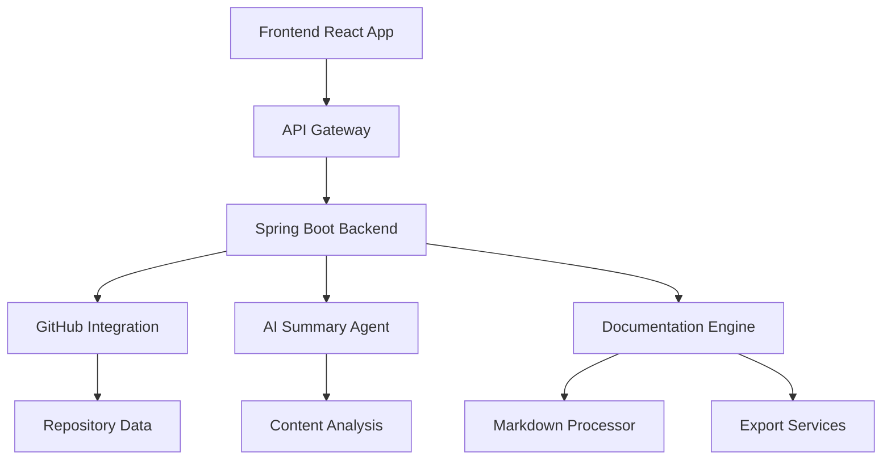
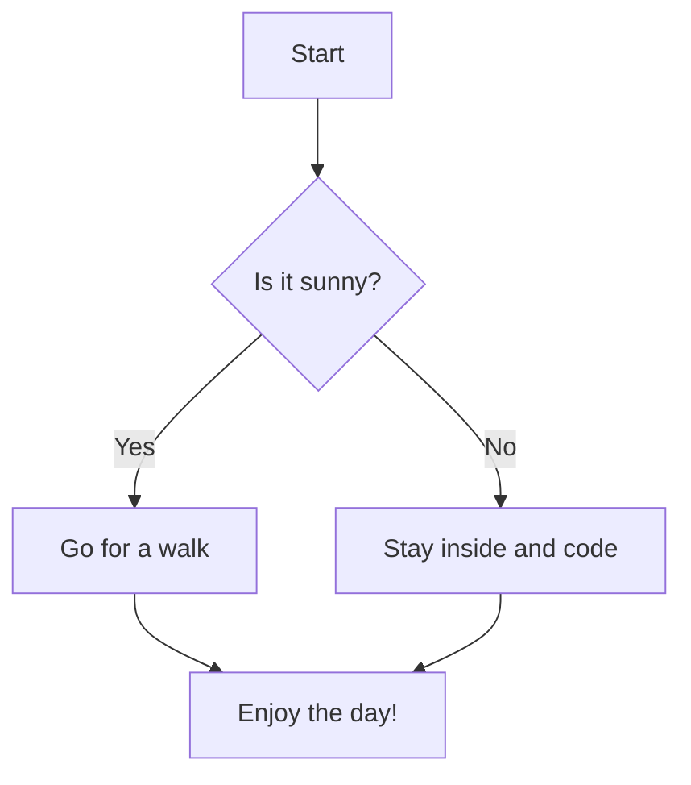

# Overview

Welcome to AutoDocX - an intelligent documentation analysis and generation system that transforms how you explore, understand, and document codebases.

## What is AutoDocX?

AutoDocX is a comprehensive full-stack application that combines the power of AI with intuitive user interface design to provide:

- **Intelligent Code Analysis**: Deep analysis of repository structures and code patterns
- **Interactive Documentation**: Dynamic, searchable documentation generation
- **AI-Powered Insights**: Smart summaries and code explanations
- **Export Capabilities**: Multiple format exports (Markdown, HTML, PDF, JSON)
- **Real-time Collaboration**: Live editing and sharing features

## System Architecture



## Key Features

### 🚀 Smart Repository Analysis
- Automatic file tree generation
- Code structure analysis  
- Dependency mapping
- Architecture visualization

### 🤖 AI-Powered Summaries
- Branch-specific content analysis
- Section-specific summaries
- Intelligent code explanations
- Context-aware recommendations

### 📁 Interactive File Explorer
- Hierarchical file navigation
- Search and filtering capabilities
- Code preview with syntax highlighting
- Drag-and-drop organization

### 📤 Multi-Format Export
- **Markdown**: Clean, readable documentation
- **HTML**: Styled web pages
- **PDF**: Professional documents
- **JSON**: Structured data export
- **ZIP**: Complete documentation packages

### 🎨 Modern User Interface
- Dark/Light theme support
- Responsive design
- Intuitive navigation
- Accessibility features

## Partial Versioning

When versioning only applies to part of your docs, You can separate them by folders.

For example:

```
<Files>
  <Folder name="java-sdk" defaultOpen>
    <Folder name="v1" defaultOpen>
      <File name="getting-started.mdx" />
    </Folder>

    <Folder name="v2" defaultOpen>
      <File name="getting-started.mdx" />
    </Folder>
  </Folder>
</Files>
```

<Callout title="Good to Know">
  You may want to group them with tabs rather than folders [using Sidebar Tabs](/docs/ui/navigation/sidebar#sidebar-tabs).
</Callout>

## Full Versioning

Sometimes you want to version the entire website, such as [https://v14.fumadocs.dev](https://v14.fumadocs.dev) (Fumadocs v14) and [https://fumadocs.dev](https://fumadocs.dev) (Latest Fumadocs).

You can create a Git branch for a version of docs (call it `v2` for example), and deploy it as a separate app on another subdomain like `v2.my-site.com`.

Optionally, you can link to the other versions from your docs.
This design allows some advantages over partial versioning:

* Easy maintenance: Old docs/branches won't be affected when you iterate or upgrade dependencies.
* Better consistency: Not just the docs itself, your landing page (and other pages) will also be versioned.


| Header 1 | Header 2 | Header 3 |
|----------|----------|----------|
| Cell 1   | Cell 2   | `code`   |
| Data     | More     | Values   |