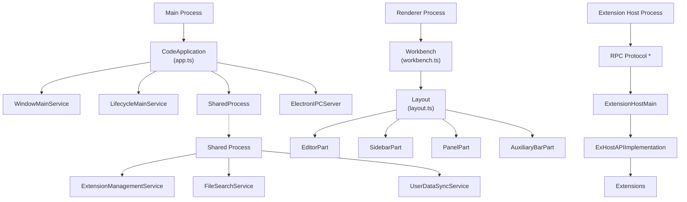
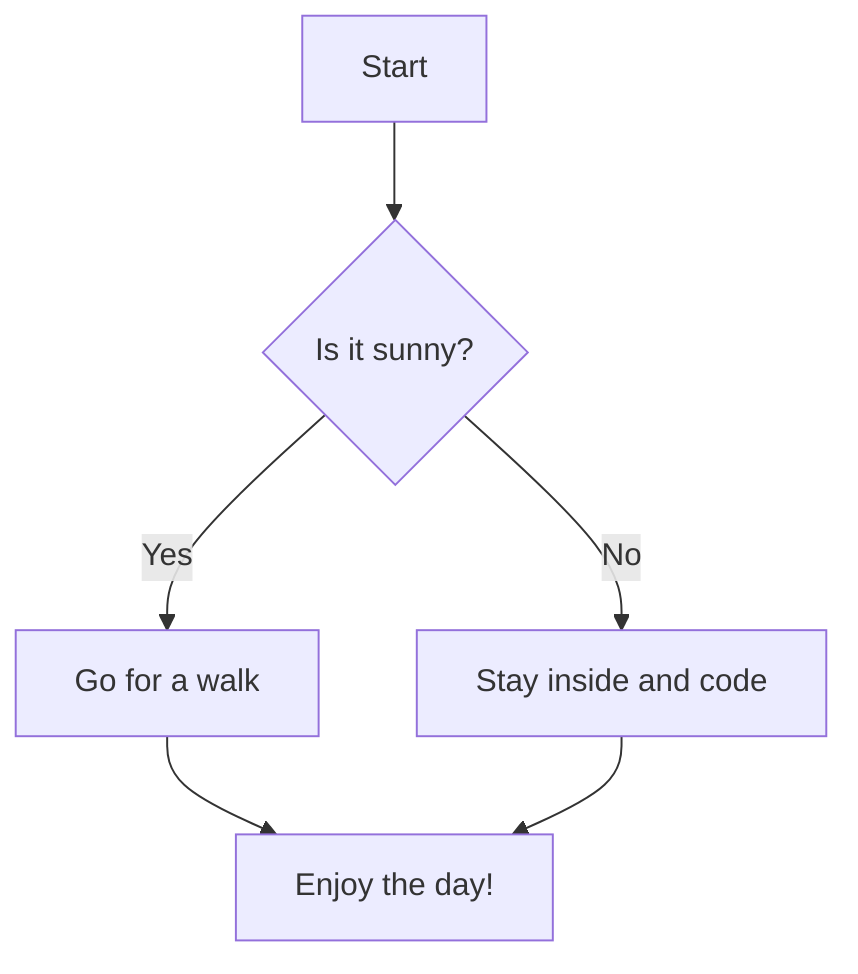

# Overview

-----------------------------------------------------

## Overview of product

It's common for developer tool related docs to version their docs, such as different docs for v1 and v2 of the same tool.

Fumadocs provide the primitives for you to implement versioning on your own way.



## Partial Versioning

When versioning only applies to part of your docs, You can separate them by folders.

For example:

```
<Files>
  <Folder name="java-sdk" defaultOpen>
    <Folder name="v1" defaultOpen>
      <File name="getting-started.mdx" />
    </Folder>

    <Folder name="v2" defaultOpen>
      <File name="getting-started.mdx" />
    </Folder>
  </Folder>
</Files>
```

<Callout title="Good to Know">
  You may want to group them with tabs rather than folders [using Sidebar Tabs](/docs/ui/navigation/sidebar#sidebar-tabs).
</Callout>

## Full Versioning

Sometimes you want to version the entire website, such as [https://v14.fumadocs.dev](https://v14.fumadocs.dev) (Fumadocs v14) and [https://fumadocs.dev](https://fumadocs.dev) (Latest Fumadocs).

You can create a Git branch for a version of docs (call it `v2` for example), and deploy it as a separate app on another subdomain like `v2.my-site.com`.

Optionally, you can link to the other versions from your docs.
This design allows some advantages over partial versioning:

* Easy maintenance: Old docs/branches won't be affected when you iterate or upgrade dependencies.
* Better consistency: Not just the docs itself, your landing page (and other pages) will also be versioned.


| Header 1 | Header 2 | Header 3 |
|----------|----------|----------|
| Cell 1   | Cell 2   | `code`   |
| Data     | More     | Values   |