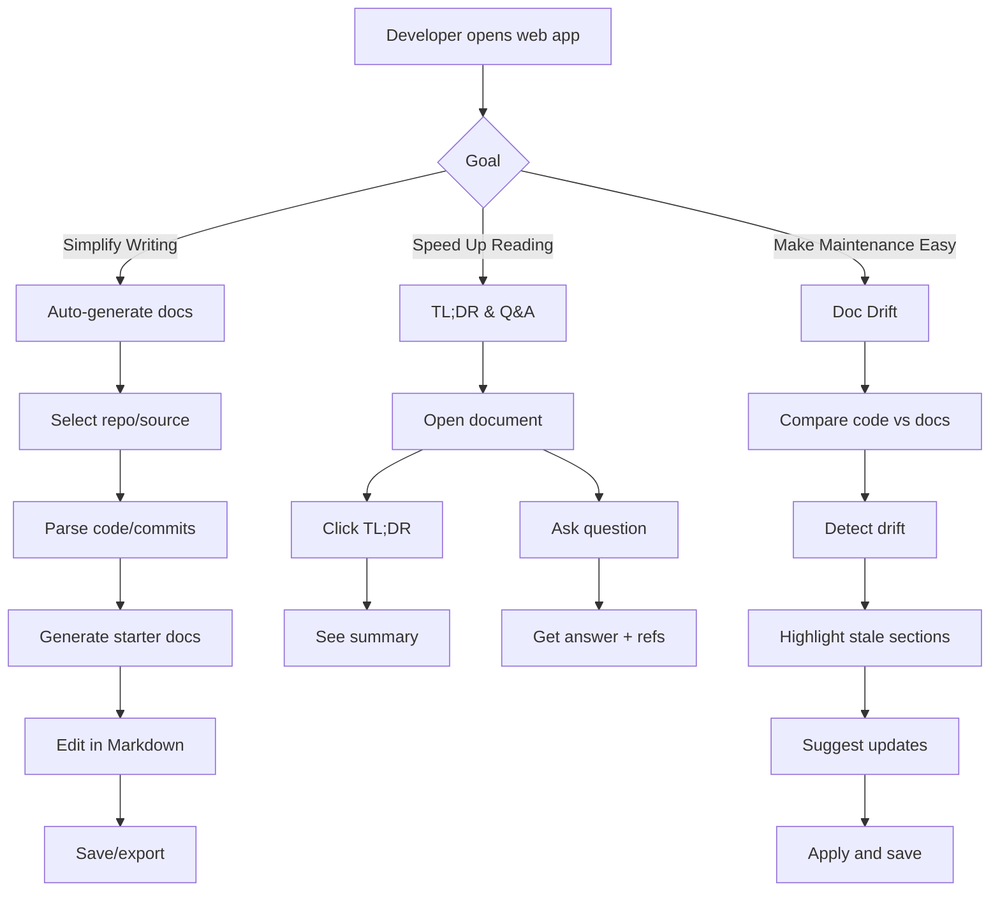

## Smart Documentation Assistant (Frontend) — Plan & Flow

### User Flow (Mermaid)

### Scope (this iteration)
- Implement two focus areas end-to-end:
  - Simplify Writing: code/commit → starter docs → editor → save
  - Speed Up Reading: TL;DR summarization and Q&A for docs
- Add Doc Drift detection UI stub with mock data (basic highlight + suggestion)

---

### Step-by-step Implementation Plan

1. Project scaffold and tooling
   - [ ] Initialize React + TypeScript (Vite) in `frontend/`
   - [ ] Install `react-router-dom`, `axios`
   - [ ] Add ESLint + Prettier config; fix initial lints
   - [ ] Create `frontend/.gitignore` for Node artifacts

2. App shell and routing
   - [ ] Create layout: `Header`, `Sidebar`, `MainContent`
   - [ ] Routes: `/`, `/write`, `/read`, `/maintenance`
   - [ ] Add basic navigation and active route styles

3. API client and environment config
   - [ ] `src/lib/api.ts` Axios instance using `VITE_API_BASE_URL`
   - [ ] Error interceptor and typed helpers
   - [ ] `.env` example (not committed): `VITE_API_BASE_URL=http://localhost:8080`

4. Simplify Writing (auto-generate docs)
   - [ ] Page `/write`: source selector (repo/commits or paste code)
   - [ ] Call backend: parse/generate starter docs
   - [ ] Markdown editor with preview and save/export
   - [ ] Template suggestions (headings/sections)

5. Speed Up Reading (TL;DR + Q&A)
   - [ ] Page `/read`: upload/paste/select doc
   - [ ] TL;DR button → summary card
   - [ ] Q&A input → answer with cited sections
   - [ ] Copy/share answer; loading and error states

6. Maintenance (doc drift) — minimal stub
   - [ ] Page `/maintenance`: list docs with drift score (mock)
   - [ ] Highlight stale sections and show suggested diffs
   - [ ] CTA to open in editor

7. UX polish and state
   - [ ] Global toasts, empty states, skeleton loaders
   - [ ] Basic accessibility (landmarks, focus ring)
   - [ ] Mobile-friendly layout

8. Demo data and scripts
   - [ ] Seed sample repo/docs dataset for demo
   - [ ] Add Demo walkthrough in README with screenshots

9. CI and quality gates
   - [ ] NPM scripts: `lint`, `typecheck`, `build`, `preview`
   - [ ] GitHub Actions: run lint/build on PR

---

### Definition of Done (per feature)
- Clear UI states: loading, success, error, empty
- Errors surfaced via toasts and inline messages
- No console errors; ESLint clean; TypeScript passes
- Minimal tests or reproducible manual steps documented

---

### Tracking (high-level tasks)
- [ ] Scaffold React + TS app in frontend with Vite
- [ ] Set up routing, layout shell, and base pages
- [ ] Create API client and env config for Spring Boot backend
- [ ] Implement Docs TL;DR summarization UI
- [ ] Implement Q&A search UI (ask docs, get answer)
- [ ] Detect doc drift: show stale doc indicators from diffs
- [ ] Add ESLint/Prettier and CI checks
- [ ] Write demo script and seed sample repo content

